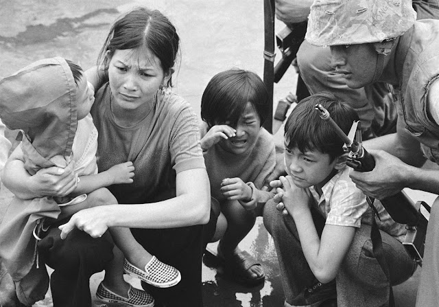

# warm-signal

## Warm Signal

### Introduction

[https://github.com/vietphan1995/warm-signal.git](https://github.com/vietphan1995/warm-signal.git)

Warm signal is an software system that connects your missing family people by collecting missing people problems, personal information then analyzes/suggests with memory, culture, history events like war, natural disease, human disease, migration, accident of individual or community where people living.

### [back to git projects …](https://github.com/vietphan1995/projects)

### Notes
https://phantrungviet.notion.site/warm-signal-1b25e832d6ee8041bcb5ee288704de7f